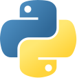

# 👋 Olá! Eu, Fabio Mendes, agradeço sua visita !

### 🏢 Sobre Mim
Especialista em **Business Intelligence e Análise de Dados** com mais de 20 anos de experiência transformando dados em decisões estratégicas em empresas nacionais e multinacionais. 

Tenho sólida vivência no mapeamento de requisitos junto a stakeholders, governança, qualidade de dados e no desenvolvimento de arquiteturas de dados complexas, incluindo **Data Warehouses, Data Marts e processos de ETL**. Minha atuação une a eficiência técnica na modelagem de dados (SQL, Oracle, SQL Server) à entrega de valor na ponta final através de Dashboards analíticos integrados de alto impacto (Power BI, SAP BO, Python...).

---

### 🛠️ Tecnologias e Ferramentas

| Categoria | Tecnologias Dominadas |
| :--- | :--- |
| **Business Intelligence & Analytics** | Power BI (DAX), SAP Business Objects, Storytelling com Dados |
| **Bancos de Dados & Armazenamento** | SQL, PL/SQL (CTE), Oracle, SQL Server, PostgreSQL, AWS Athena, Amazon S3 | Azure 
| **Integração & Engenharia de Dados**| ETL, Modelagem Dimensional/Relacional, Data Warehouse, Cubos, Python |

 

  
 

  
/p>

### 🌐 Conecte-se Comigo

  
  

  

  

